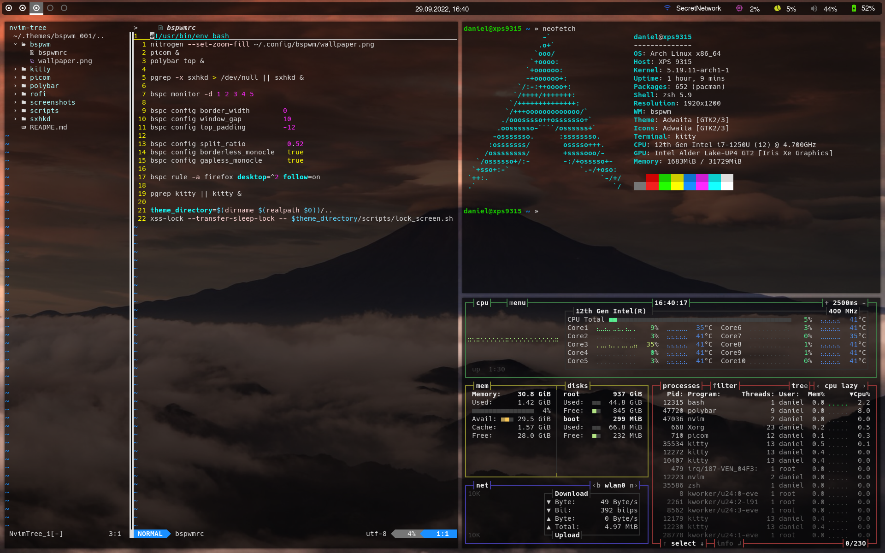

# .themes

## Usage

1. Clone this repository.
2. Read the README.md of the desired theme and install all requirements.
3. Run the .themes/theme_XYZ/scripts/install.sh script to create symbolic links to the configuration files.

## Themes

### bspwm_001

 
 

 
 

