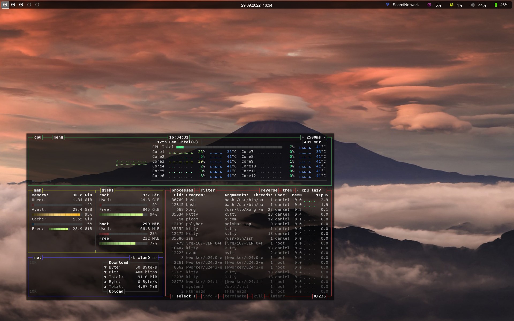
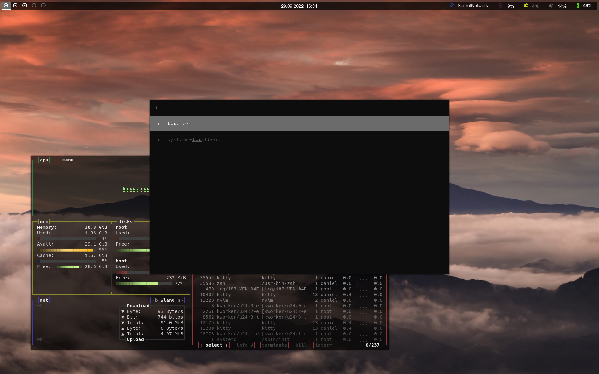
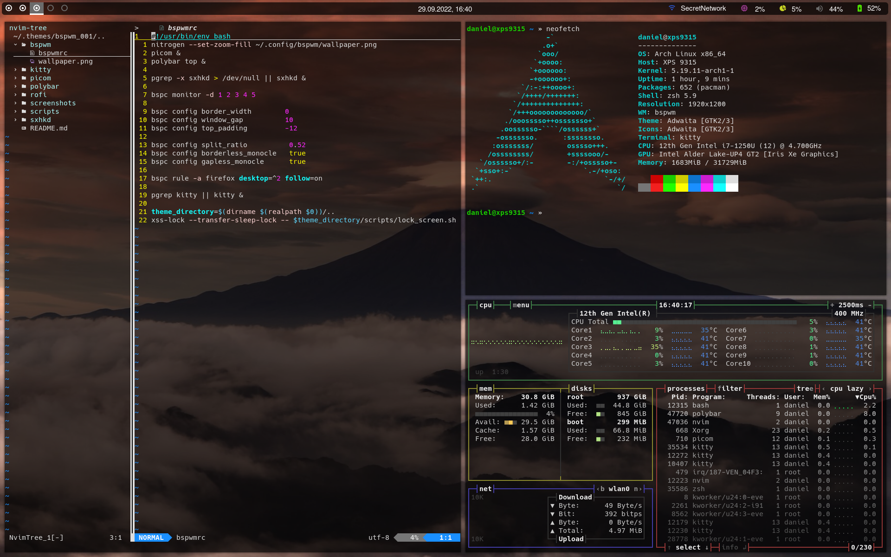

# Theme: bspwm_001

## Requirements

- [bspwm](https://github.com/baskerville/bspwm)
- [Hack Nerd Font](https://www.nerdfonts.com/)
- [i3lock](https://github.com/i3/i3lock)
- [kitty](https://github.com/kovidgoyal/kitty)
- [nitrogen](https://github.com/l3ib/nitrogen/)
- [picom](https://github.com/yshui/picom)
- [polybar](https://github.com/polybar/polybar)
- [rofi](https://github.com/davatorium/rofi)
- [sxhkd](https://github.com/baskerville/sxhkd)

## Screenshots

 
 

 
 

